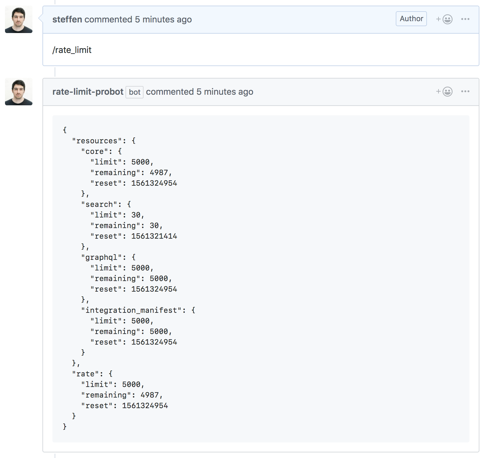

# rate-limit-probot

A Probot app that supports a `/rate_limit` command in issue and pull request comments which creates a comment with the [current rate limit status](http://octokit.github.io/rest.js/#octokit-routes-rateLimit).



## Setup

```sh
# Install dependencies
npm install

# Run the bot
npm start
```

## Contributing

If you have suggestions for how rate-limit-probot could be improved, or want to report a bug, open an issue! We'd love all and any contributions.

For more, check out the [Contributing Guide](CONTRIBUTING.md).

## License

[ISC](LICENSE) © 2019 Steffen Hiller <steffen@github.com>
