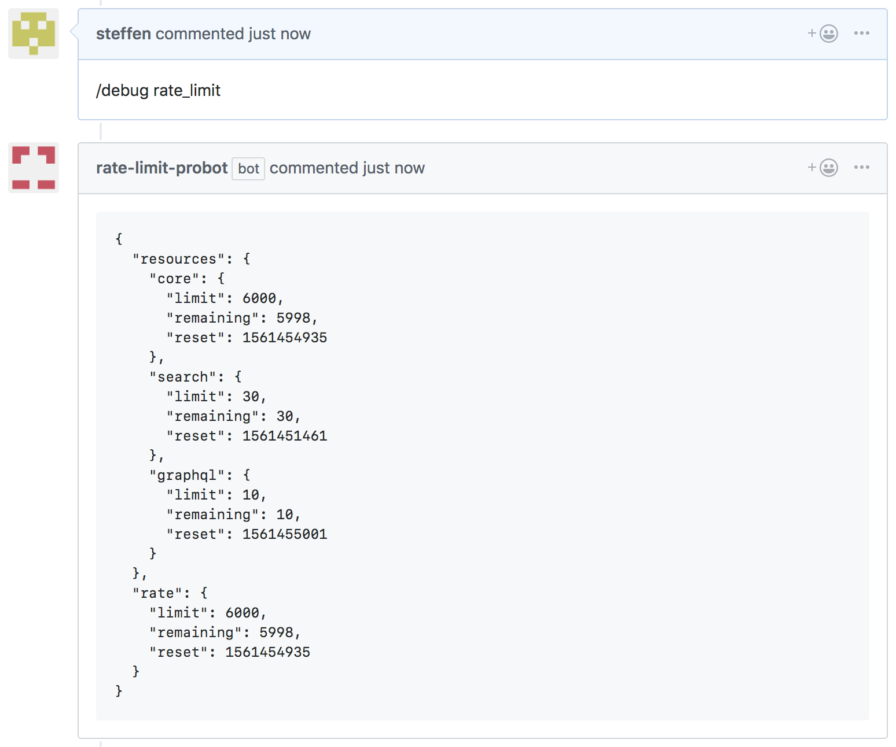
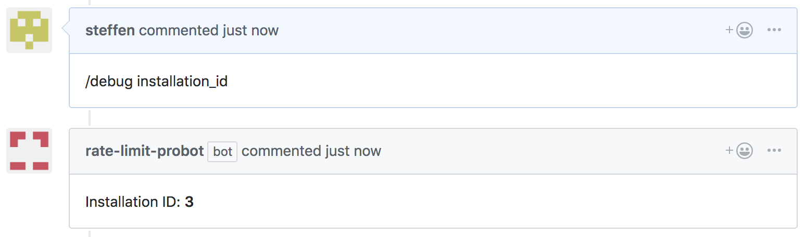
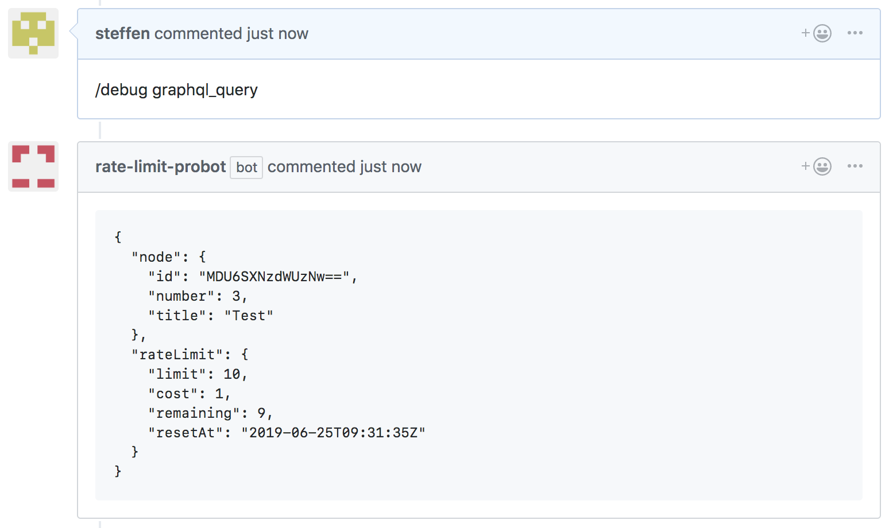

# rate-limit-probot

A Probot app that supports a `/debug` command in issue and pull request comments which helps debugging rate limit issues with Probot apps.

## Usage

### /debug rate_limit

Creates a comment with the [current rate limit status](http://octokit.github.io/rest.js/#octokit-routes-rateLimit).  
_Note that GitHub App installations may have a higher rate limit depending on number of users and repositories, see [here](https://developer.github.com/apps/building-github-apps/understanding-rate-limits-for-github-apps/)._



### /debug installation_id

Creates a comment with the installation ID. _Note that rate limits count per installation._  



### /debug graphql_query

Makes a GraphQL request that counts against the GraphQL rate limit and creates a comment with the returned GraphQL [rate limiting field values](https://developer.github.com/v4/guides/resource-limitations/#returning-a-calls-rate-limit-status).



## Setup

```sh
# Install dependencies
npm install

# Run the bot
npm start
```

## Contributing

If you have suggestions for how rate-limit-probot could be improved, or want to report a bug, open an issue! We'd love all and any contributions.

For more, check out the [Contributing Guide](CONTRIBUTING.md).

## License

[ISC](LICENSE) © 2019 Steffen Hiller <steffen@github.com>
